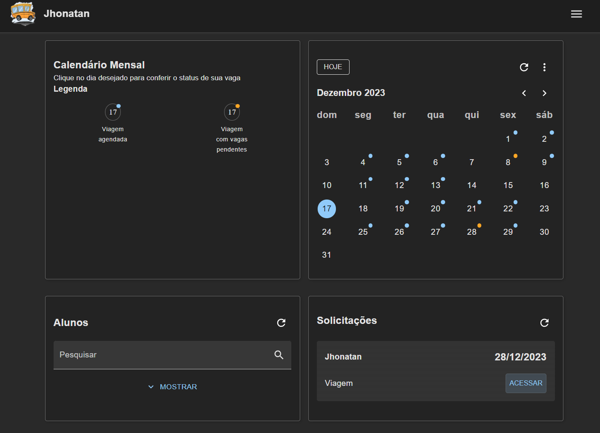
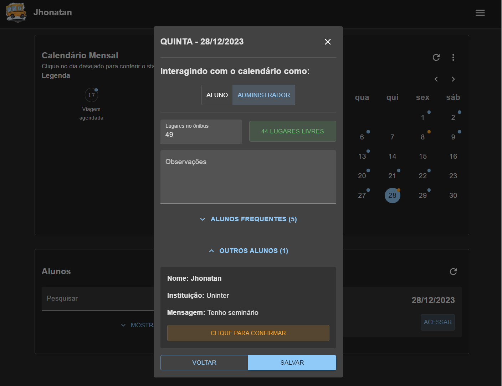

# Busão Escolar (School Bus) - Daily College Travel Registration System

This is a project for a registration system for daily bus trips to college. Students can register, indicate the days of the week they will need a reserved seat, and request seats on specific days. The entire system is managed by the administrator, who has control over student attendance, approval of registrations and extra seat requests, and the ability to print the monthly travel list and manage the days the bus will travel.

## Prints



## Technologies Used

### Backend
- Node.js with TypeScript
- MongoDB and Mongoose for data storage
- Automatic email sending for communication with students

### Frontend
- Next.js for web interface development
- Material-UI for an elegant and responsive design
- Context API for state management
- JWT token for authentication and authorization

## Installation and Configuration

### Backend

1. Clone the repository:

   ```bash
   git clone https://github.com/jhonatec-dev/busao_escolar.git
   ```

2. Navigate to the backend directory:

   ```bash
   cd busao_escolar/backend
   ```

3. Install dependencies:

   ```bash
   npm install
   ```

4. Configure environment variables in the `.env` file, including MongoDB credentials and automatic email sending settings.

5. Run the server:

   ```bash
   npm run dev
   ```

### Frontend

1. Navigate to the frontend directory:

   ```bash
   cd busao_escolaar/frontend
   ```

2. Install dependencies:

   ```bash
   npm install
   ```

3. Configure environment variables in the `.env.local` file, including the backend URL.

4. Run the application:

   ```bash
   npm run dev
   ```

## Features

- **Student Registration:**
  - Students can register in the system, indicating the days of the week they will need a reserved seat.

- **Extra Seat Requests:**
  - Students can request seats on specific days, even if they are not registered for regular days.

- **Administrator Management:**
  - The administrator can approve student registrations, change student attendance, approve requests for extra seats, and manage the days the bus will travel.

- **Printing Monthly Travel List:**
  - The administrator can print the monthly travel list for planning and record-keeping.

## Contribution

Feel free to contribute to this project. Just follow the contribution guidelines and submit a pull request.

## License

This project is licensed under the [MIT License](LICENSE).